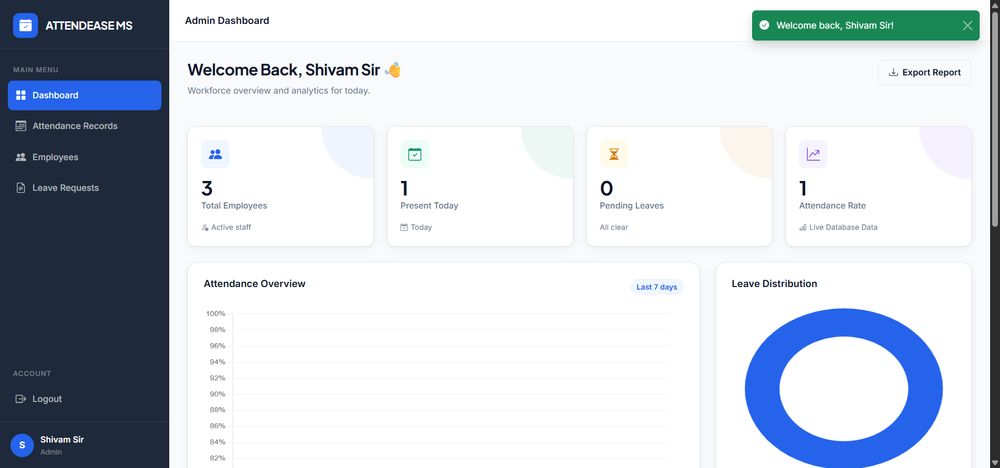
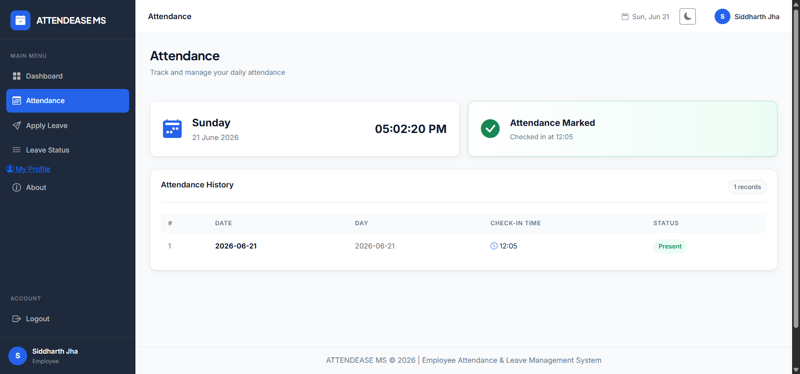
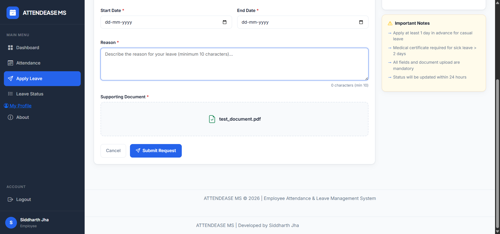
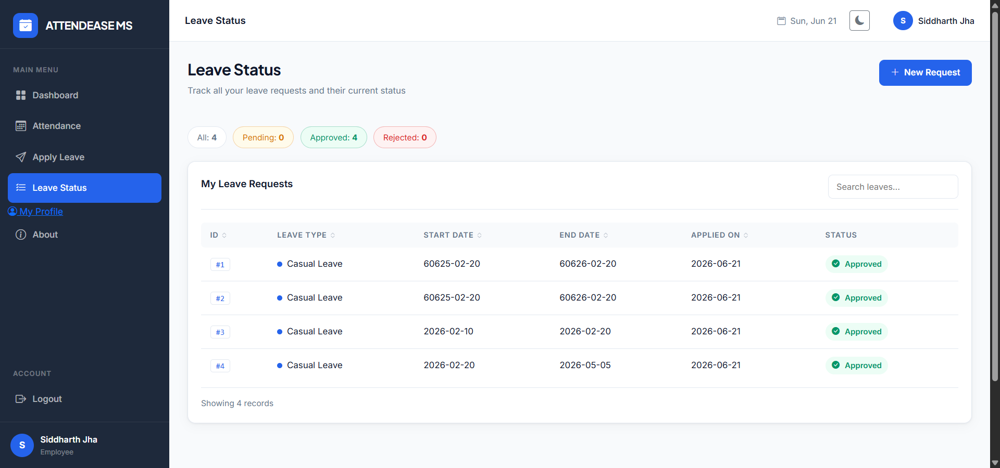
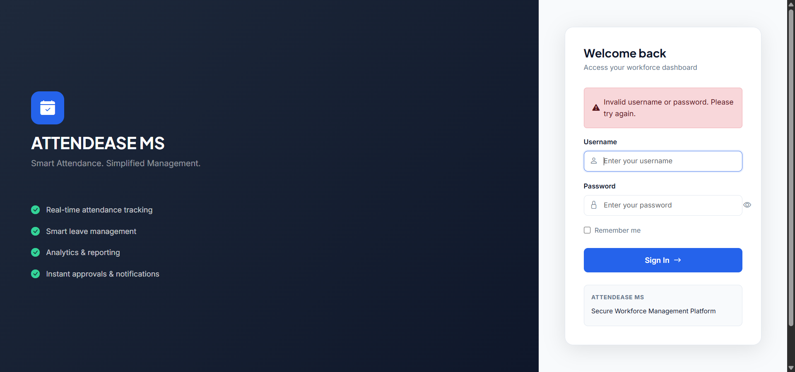
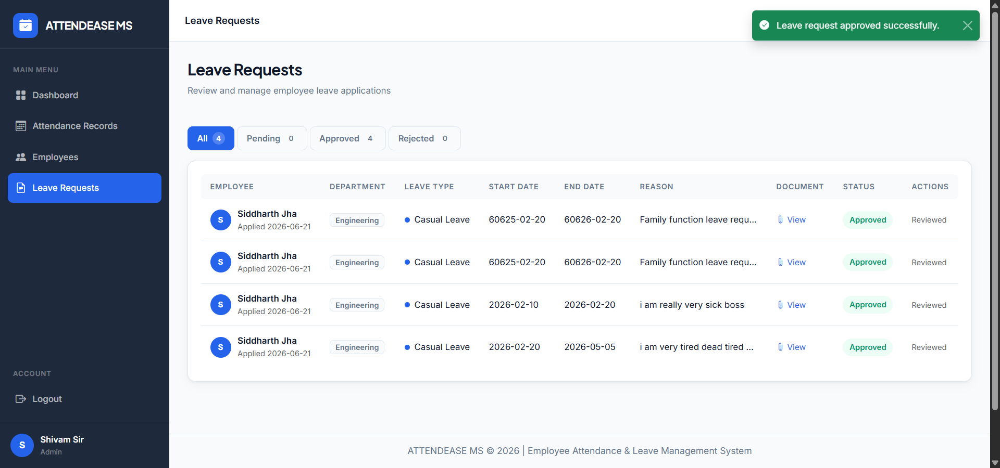

# ATTENDEASE – HR Management System with Selenium Automation Testing


## Live Application

https://attendease-q9vb.onrender.com/login

---

## Overview

ATTENDEASE is a Human Resource Management System (HRMS) developed using Python and Flask. The project includes a complete Selenium-based automation testing framework built using PyTest and the Page Object Model (POM) design pattern.

The automation framework validates critical HR workflows such as authentication, attendance tracking, leave management, and administrative approval processes.

---

## Features

### Employee Features

* Employee Login
* Attendance Management
* Attendance Export
* Leave Application
* Leave Status Tracking

### Admin Features

* Leave Request Review
* Leave Approval Management

### Automation Framework Features

* Selenium WebDriver Automation
* Page Object Model (POM)
* Explicit Waits using WebDriverWait
* Assertions for All Test Cases
* Externalized Test Data using JSON
* Automatic Screenshot Capture for Failed Test Cases
* HTML Execution Reports using pytest-html

---

## Technology Stack

| Component         | Technology              |
| ----------------- | ----------------------- |
| Backend           | Python, Flask           |
| Frontend          | HTML, CSS, JavaScript   |
| Database          | SQLite                  |
| Automation        | Selenium WebDriver      |
| Testing Framework | PyTest                  |
| Design Pattern    | Page Object Model (POM) |
| Reporting         | pytest-html             |
| Version Control   | Git & GitHub            |
| Deployment        | Render                  |

---

## Automated Test Coverage

### Authentication Tests

* Valid Login
* Invalid Login
* Empty Login Validation
* Logout Functionality

### Attendance Tests

* Mark Attendance
* Duplicate Attendance Validation

### Leave Management Tests

* Apply Leave Successfully
* Leave Form Validation
* View Leave Status

### Administrative Tests

* Admin Leave Approval

### Total Automated Tests

**10 Automated Test Cases** covering:

* Authentication
* Attendance Management
* Leave Management
* Administrative Workflows

---

## Project Structure

```text
ATTENDEASE
│
├── automation
│   ├── pages
│   │   ├── login_page.py
│   │   ├── attendance_page.py
│   │   ├── leave_page.py
│   │   └── admin_page.py
│   │
│   ├── tests
│   │   ├── test_valid_login.py
│   │   ├── test_invalid_login.py
│   │   ├── test_empty_login.py
│   │   ├── test_logout.py
│   │   ├── test_mark_attendance.py
│   │   ├── test_duplicate_attendance.py
│   │   ├── test_apply_leave.py
│   │   ├── test_leave_validation.py
│   │   ├── test_view_leave_status.py
│   │   └── test_admin_approval.py
│   │
│   ├── screenshots
│   ├── reports
│   ├── test_data.json
│   └── conftest.py
│
├── templates
├── static
├── uploads
│
├── app.py
├── requirements.txt
├── README.md
└── automation/reports/report.html
```

---

## Installation

Clone the repository:

```bash
git clone https://github.com/SiddharthJha1602/ATTENDEASE.git
cd ATTENDEASE
```

Install dependencies:

```bash
pip install -r requirements.txt
```

---

## Running Automated Tests

Run all test cases:

```bash
pytest automation/tests -v
```

Generate HTML report:

```bash
pytest automation/tests -v --html=automation/reports/report.html
```

---

## Test Artifacts

### HTML Report

Location:

```text
automation/reports/report.html
```

### Screenshots

Location:

```text
automation/screenshots/
```

### Failure Screenshots

Automatically captured when a test fails.

Location:

```text
automation/screenshots/failures/
```

---

## Screenshots

### Login Page



### Attendance Marked Successfully



### Leave Application



### Leave Status



### Invalid Login Validation



### Admin Leave Approval



---

## Manual Test Cases

The automation suite was designed based on manually prepared test cases covering:

* Valid Login
* Invalid Login
* Empty Login Validation
* Logout Functionality
* Attendance Marking
* Duplicate Attendance Validation
* Leave Application
* Leave Validation
* Leave Status Tracking
* Admin Leave Approval

Manual test case document:

```text
automation/Manual_Test_Cases.md
```

---

## Bug Report

A bug report was prepared during testing and validation activities.

Document location:

```text
automation/Bug_Report.md
```

Sample observations:

* Duplicate attendance prevention validation
* Leave form validation checks
* Admin approval workflow verification

---

## Results

✅ 10 Automated Test Cases Executed Successfully

✅ Selenium WebDriver Framework Implemented

✅ Page Object Model (POM) Architecture Applied

✅ Explicit Waits Implemented Using WebDriverWait

✅ Assertions Used in All Test Cases

✅ Test Data Externalized Using JSON

✅ HTML Execution Report Generated Using pytest-html

✅ Screenshots Captured for Failed Test Cases

✅ Attendance, Leave, Login, Logout and Admin Modules Automated

✅ Application Successfully Deployed on Render

---

## Learning Outcomes

Through this project, the following concepts were implemented and practiced:

* Selenium WebDriver Automation
* Page Object Model (POM)
* Automated Testing with PyTest
* Explicit Waits and Synchronization
* Test Data Management using JSON
* Screenshot Capture and Reporting
* Flask Web Application Testing
* Git and GitHub Version Control
* Deployment on Render

---

## Author

**Siddharth Jha**

B.Tech Computer Science Engineering
Manipal University Jaipur

GitHub:
https://github.com/SiddharthJha1602

---

## Project Status

✅ Completed

✅ Tested Successfully

✅ Ready for Internship Submission
